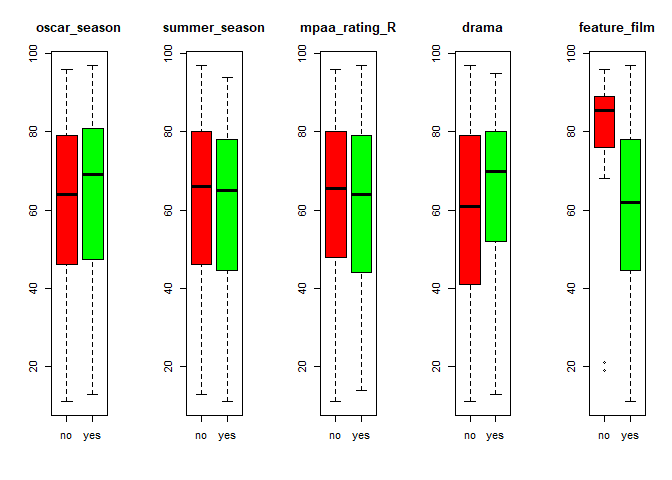
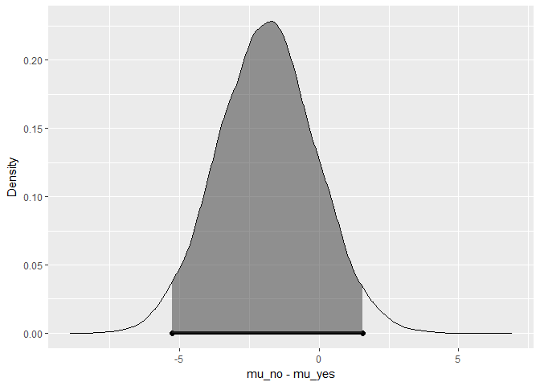
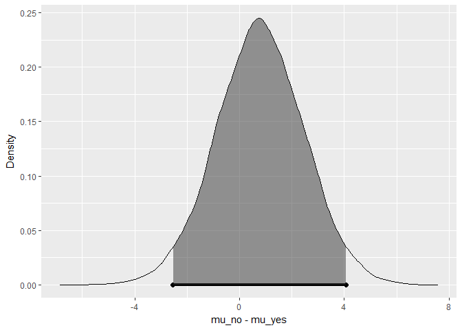
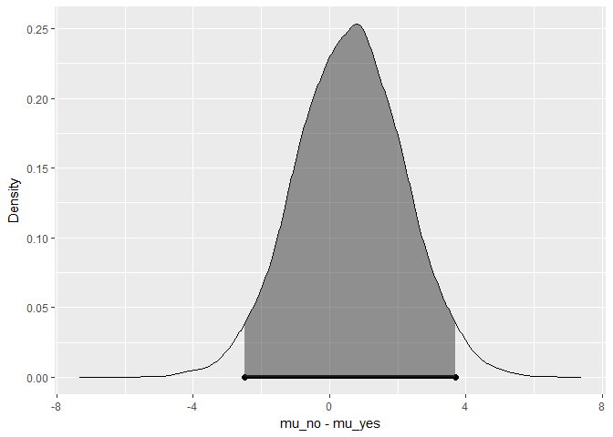
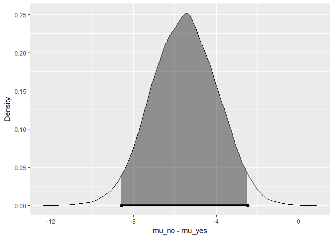
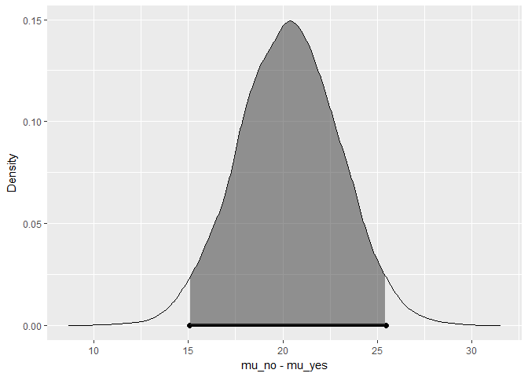
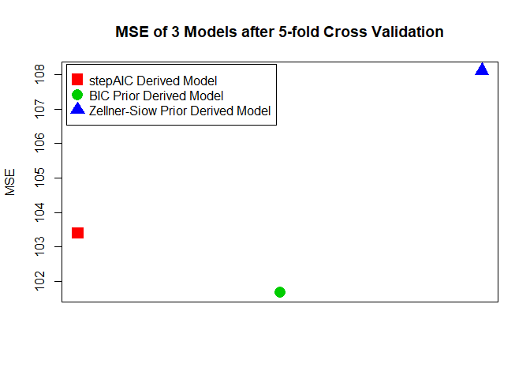

Bayesian modeling and prediction for movies
================
Hongyun Wang

Setup
-----

``` r
# set global knitr options
knitr::opts_chunk$set(comment=NA, fig.align='center', warning=FALSE)
```

### Load packages

``` r
library(ggplot2)
library(MASS)
library(dplyr)
library(statsr)
library(BAS)
```

### Load data

The R workspace `movies.RData` was downloaded from Coursera Course page and saved in the `data` directory which is under the same directory as the Rmd file. Use `load` function to load this workspace.

``` r
load("data/movies.Rdata")
dat <- movies
```

------------------------------------------------------------------------

Part 1: Data
------------

The data set `movies`is comprised of 651 randomly sampled movies produced and released from 1970 to 2014. The sources of this data set are from Rotten Tomatoes and IMDB. Since the movies in this data set are randomly selected from a large movie sets (random sampling conducted), the movies in this data set can be **generalized** to the entire population. However, the data set cannot be used to establish **causal** relationships between the variables of interest beacuse there was no random assignment to the explanatory variables.

Preliminary check on the data set `movies`. The results are suppressed.

``` r
dim(dat)
head(dat); tail(dat)
str(dat)
summary(dat)
```

------------------------------------------------------------------------

Part 2: Data manipulation
-------------------------

Create 5 new variables using the mutate function in the dplyr package.

``` r
# Assign yes to new variable feature_film, where title_type is "Feature Film". Otherwise no.
dat <- dat %>% mutate(feature_film = as.factor(ifelse(title_type == 'Feature Film', 'yes', 'no')))
# Assign yes to new variable drama, where genre is "Drama". Otherwise no.
dat <- dat %>% mutate(drama = as.factor(ifelse(genre == 'Drama', 'yes', 'no')))
# Assign yes to new variable mpaa_rating_R, where mpaa_rating is "R". Otherwise no.
dat <- dat %>% mutate(mpaa_rating_R = as.factor(ifelse(mpaa_rating == 'R', 'yes', 'no')))
# Assign yes to new variable oscar_season, where thtr_rel_month is either "10", "11", "12". Otherwise no.
dat <- dat %>% mutate(oscar_season = as.factor(ifelse(thtr_rel_month %in% c('10', '11', '12'), 'yes', 'no')))
# Assign yes to new variable summer_season, where thtr_rel_month is either "5", 6", "7", "8". Otherwise no.
dat <- dat %>% mutate(summer_season = as.factor(ifelse(thtr_rel_month %in% c('5', '6', '7', '8'), 'yes', 'no')))

# newly created variables
str(dat[, c((ncol(dat)-4):ncol(dat) )])
```

    Classes 'tbl_df', 'tbl' and 'data.frame':   651 obs. of  5 variables:
     $ feature_film : Factor w/ 2 levels "no","yes": 2 2 2 2 2 1 2 2 1 2 ...
     $ drama        : Factor w/ 2 levels "no","yes": 2 2 1 2 1 1 2 2 1 2 ...
     $ mpaa_rating_R: Factor w/ 2 levels "no","yes": 2 1 2 1 2 1 1 2 1 1 ...
     $ oscar_season : Factor w/ 2 levels "no","yes": 1 1 1 2 1 1 1 2 1 1 ...
     $ summer_season: Factor w/ 2 levels "no","yes": 1 1 2 1 1 1 1 1 1 1 ...

------------------------------------------------------------------------

Part 3: Exploratory data analysis
---------------------------------

Conduct exploratory data analysis of the relationship between `audience_score` and the new variables constructed in the previous part.

``` r
# a new data set containing response var audience_score and 5 new varialbes.
dat.eda <- na.omit(as.data.frame(dat[, c('audience_score', 'oscar_season', 'summer_season', 'mpaa_rating_R', 'drama', 'feature_film' )]))
# calculate descriptive statistics of the distribution
(score.mean <- mean(dat.eda$audience_score))
```

    [1] 62.36252

``` r
(score.median <- median(dat.eda$audience_score))
```

    [1] 65

``` r
freq <- table(dat.eda$audience_score)
(score.mode <- as.numeric(names(freq[which(freq == max(freq))])))
```

    [1] 81

``` r
summary(dat.eda$audience_score)
```

       Min. 1st Qu.  Median    Mean 3rd Qu.    Max. 
      11.00   46.00   65.00   62.36   80.00   97.00 

``` r
IQR(dat.eda$audience_score)
```

    [1] 34

``` r
#
hist(dat.eda$audience_score, breaks=50, col="cyan", main="Distribution of audience_score") 
abline(v=score.mean, col="blue", lwd=4)
abline(v=score.median, col="red", lwd=4) 
abline(v=score.mode, col="forestgreen", lwd=4) 
legend("topleft", inset=c(0.01, 0.01), lty=c(1,1,1), legend=c("Mean", "Median", "Mode"), lwd=c(4,4,4), col=c("red", "blue", "forestgreen"))
```

 The `audience_score` shows a slight left skewed structure. The IQR of the audience\_score is 34 (1st Qu - 46 and 3rd Qu. 80), while the mean is around 62.4, the median is 65 and the mode is about 81.

To compare the variability of the different new variables, `audience_score` was summarized by the two groups of each new variable. And also a combined boxplot was used to show the summarized data. The new variables do not show much variability, which leads to the conclusion that none of the above variables are valuable towards the prediction of the audience score. From boxplot, there is a clear differentiation between "yes"" and "no" groups of variable `feature_film`, which indicates that variable `feature_film` might be relevant to `audience_score`.

``` r
# a function to summarize audience_score by earch variable
dat.summ <- function(var, data) {
  out = aggregate(audience_score ~ get(var), data=data, 
                  function(x) round(c(mean=mean(x),median=median(x),min=min(x),max=max(x),IQR=IQR(x)),2))
  names(out)[1] <- "yes_no"
  cbind(data.frame(Variable=var),out)
}
# summary of audience_score by five variables
do.call(rbind, lapply(names(dat.eda)[-1], dat.summ, data=dat.eda))
```

            Variable yes_no audience_score.mean audience_score.median
    1   oscar_season     no               61.81                 64.00
    2   oscar_season    yes               63.69                 69.00
    3  summer_season     no               62.62                 66.00
    4  summer_season    yes               61.81                 65.00
    5  mpaa_rating_R     no               62.69                 65.50
    6  mpaa_rating_R    yes               62.04                 64.00
    7          drama     no               59.73                 61.00
    8          drama    yes               65.35                 70.00
    9   feature_film     no               81.05                 85.50
    10  feature_film    yes               60.47                 62.00
       audience_score.min audience_score.max audience_score.IQR
    1               11.00              96.00              33.00
    2               13.00              97.00              33.50
    3               13.00              97.00              34.00
    4               11.00              94.00              33.25
    5               11.00              96.00              31.75
    6               14.00              97.00              35.00
    7               11.00              97.00              38.00
    8               13.00              95.00              28.00
    9               19.00              96.00              12.50
    10              11.00              97.00              33.50

``` r
# boxplot of audience_score by five variables
par(mfrow=c(1,5))
for (i in names(dat.eda)[-1]) {
  boxplot(audience_score ~ get(i), data=dat.eda, col=c("red", "green"), main=i)
}
```

 Furthermore, Bayesian hypothesis test by calculating a Bayes factor for each feature was conducted to investigate whether the newly created variables influence `audience_score`. Here are the two hypothesis tests:


``` r
# a function to get bayes factor for each variable
getBF <- function(var, data) {
  bayes_inference(y = audience_score, x = get(var), data = data, statistic = "mean", 
                  type = "ht", null = 0, alternative = "twosided", 
                  show_summ = FALSE)
}

# Bayes factor for each variable
names(dat.eda)[2]
```

    [1] "oscar_season"

``` r
bf2 <- getBF(names(dat.eda)[2], dat.eda)
```

    Hypotheses:
    H1: mu_no  = mu_yes
    H2: mu_no != mu_yes

    Priors: P(H1) = 0.5  P(H2) = 0.5 

    Results:
    BF[H1:H2] = 8.2858
    P(H1|data) = 0.8923 
    P(H2|data) = 0.1077 

    Posterior summaries for under H2:
    95% Cred. Int.: (-5.2699 , 1.5644)



``` r
names(dat.eda)[3]
```

    [1] "summer_season"

``` r
bf3 <- getBF(names(dat.eda)[3], dat.eda)
```

    Hypotheses:
    H1: mu_no  = mu_yes
    H2: mu_no != mu_yes

    Priors: P(H1) = 0.5  P(H2) = 0.5 

    Results:
    BF[H1:H2] = 13.4039
    P(H1|data) = 0.9306 
    P(H2|data) = 0.0694 

    Posterior summaries for under H2:
    95% Cred. Int.: (-2.5507 , 4.077)



``` r
names(dat.eda)[4]
```

    [1] "mpaa_rating_R"

``` r
bf4 <- getBF(names(dat.eda)[4], dat.eda)
```

    Hypotheses:
    H1: mu_no  = mu_yes
    H2: mu_no != mu_yes

    Priors: P(H1) = 0.5  P(H2) = 0.5 

    Results:
    BF[H1:H2] = 14.8147
    P(H1|data) = 0.9368 
    P(H2|data) = 0.0632 

    Posterior summaries for under H2:
    95% Cred. Int.: (-2.4988 , 3.6974)



``` r
names(dat.eda)[5]
```

    [1] "drama"

``` r
bf5 <- getBF(names(dat.eda)[5], dat.eda)
```

    Hypotheses:
    H1: mu_no  = mu_yes
    H2: mu_no != mu_yes

    Priors: P(H1) = 0.5  P(H2) = 0.5 

    Results:
    BF[H2:H1] = 31.9101
    P(H1|data) = 0.0304 
    P(H2|data) = 0.9696 

    Posterior summaries for under H2:
    95% Cred. Int.: (-8.5952 , -2.483)



``` r
names(dat.eda)[6]
```

    [1] "feature_film"

``` r
bf6 <- getBF(names(dat.eda)[6], dat.eda)
```

    Hypotheses:
    H1: mu_no  = mu_yes
    H2: mu_no != mu_yes

    Priors: P(H1) = 0.5  P(H2) = 0.5 

    Results:
    BF[H2:H1] = 338337769673
    P(H1|data) = 0 
    P(H2|data) = 1 

    Posterior summaries for under H2:
    95% Cred. Int.: (15.0873 , 25.485)



``` r
bf.out <- data.frame(Variable=names(dat.eda)[-1], H12=c(bf2$BF,bf3$BF,bf4$BF,rep(NA,2)), H21=c(rep(NA,3),bf5$BF,bf6$BF), Evidence_against=c(rep("H2 (Positive)",3),"H1 (Positive)", "H1 (Very Strong)"))
names(bf.out)[2:3] <- c("BF[H1:H2]", "BF[H2:H1]")

# summary of bayes factor for each variable
bf.out
```

           Variable BF[H1:H2]    BF[H2:H1] Evidence_against
    1  oscar_season  8.285826           NA    H2 (Positive)
    2 summer_season 13.403881           NA    H2 (Positive)
    3 mpaa_rating_R 14.814691           NA    H2 (Positive)
    4         drama        NA 3.191009e+01    H1 (Positive)
    5  feature_film        NA 3.383378e+11 H1 (Very Strong)

From table abobe, the newly created variable `feature_film` has Bayes factor `> 150`, which indicates very strong evdience against . Other four variables have Bayes factors `< 30`, which mean there are positive evidence against either  (`drama`) or  (`oscar_season`, `summer_season`, `mpaa_rating_R`).In conclusion here, there is a significant difference in mean `audience_score` between feature and non-feathre films. There is no significant difference in mean `audience_score` between two groups of other four new variables (`oscar_season`, `summer_season`, `mpaa_rating_R`, `drama`).

------------------------------------------------------------------------

Part 4: Modeling
----------------

The full model: audience\_score ~ feature\_film + drama + runtime + mpaa\_rating\_R + thtr\_rel\_year + oscar\_season + summer\_season + imdb\_rating + imdb\_num\_votes + critics\_score + best\_pic\_nom + best\_pic\_win + best\_actor\_win + best\_actress\_win + best\_dir\_win + top200\_box

### Bayesian Model Averaging (BMA)

Bayesian model averaging is a comprehensive approach to address model uncertainty. Through calculating posterior distributions over coefficients and models, it evaluates the robustness of results to alternative specifications. BIC will be used as a way to approximate the log of the marginal likelihood and used to explore model uncertainty using posterior probabilities. The Bayesian information criterion (BIC) runs through several fitted model objects for which a log-likelihood value can be obtained, according to the formula }"), where `npar` represents the number of parameters and `nobs` the number of observations in the fitted model. The model selection will be conducted on by using two different priors (BIC and Zellner-Siow). Later Akaike information criterion (AIC), which uses a backward variable elimination method, will be used to find a model. Final model was derived after comparing those three models using cross validation method.

``` r
# variables of interest
vars <- c( 'audience_score', 'feature_film', 'drama', 'runtime', 'mpaa_rating_R', 'thtr_rel_year',
'oscar_season', 'summer_season', 'imdb_rating', 'imdb_num_votes', 'critics_score',
'best_pic_nom', 'best_pic_win', 'best_actor_win', 'best_actress_win', 'best_dir_win',
'top200_box')
# a subset with audeince_score and other 16 explanatory variables.
dat.model <- na.omit(as.data.frame(dat[, vars]))
```

### Bayesian Information Criterion as prior

``` r
audience.BIC = bas.lm(formula = audience_score ~ .,
                      prior = "BIC",
                      modelprior = uniform(),
                      data = dat.model)
```

Below is the marginal posterior inclusion probabilities, which is the probability that the predictor variable is included in the model.

``` r
audience.BIC$probne0
```

     [1] 1.00000000 0.06536947 0.04319833 0.46971477 0.19984016 0.09068970
     [7] 0.07505684 0.08042023 1.00000000 0.05773502 0.88855056 0.13119140
    [13] 0.03984766 0.14434896 0.14128087 0.06693898 0.04762234

#### Coefficient Summaries

Below are the marginal posterior mean, standard deviation and posterior inclusion probabilities obtained by BMA.

``` r
audience.BIC.coef = coef(audience.BIC)
interval <- confint(audience.BIC.coef)
names <- c("post mean", "post sd", colnames(interval))
interval <- cbind(audience.BIC.coef$postmean, audience.BIC.coef$postsd, interval)
colnames(interval) <- names
interval
```

                            post mean      post sd          2.5%        97.5%
    Intercept            6.234769e+01 3.946018e-01  6.159128e+01 6.313865e+01
    feature_filmyes     -1.046908e-01 5.642631e-01 -9.966035e-01 1.486581e-01
    dramayes             1.604413e-02 1.939207e-01  0.000000e+00 0.000000e+00
    runtime             -2.567772e-02 3.118473e-02 -8.338748e-02 0.000000e+00
    mpaa_rating_Ryes    -3.036174e-01 7.032090e-01 -2.124631e+00 1.981992e-04
    thtr_rel_year       -4.532635e-03 1.818946e-02 -5.572532e-02 1.458559e-04
    oscar_seasonyes     -8.034940e-02 3.773258e-01 -1.018363e+00 0.000000e+00
    summer_seasonyes     8.704545e-02 3.831385e-01  0.000000e+00 1.065205e+00
    imdb_rating          1.498203e+01 7.310236e-01  1.368854e+01 1.657245e+01
    imdb_num_votes       2.080713e-07 1.312970e-06 -1.328158e-07 1.888337e-06
    critics_score        6.296648e-02 3.027908e-02  0.000000e+00 1.061329e-01
    best_pic_nomyes      5.068035e-01 1.567903e+00  0.000000e+00 5.044081e+00
    best_pic_winyes     -8.502836e-03 8.479272e-01  0.000000e+00 0.000000e+00
    best_actor_winyes   -2.876695e-01 8.318203e-01 -2.639164e+00 8.633456e-04
    best_actress_winyes -3.088382e-01 9.057061e-01 -2.781218e+00 0.000000e+00
    best_dir_winyes     -1.195011e-01 6.227133e-01 -1.157176e+00 0.000000e+00
    top200_boxyes        8.648185e-02 7.049625e-01  0.000000e+00 0.000000e+00
                                 beta
    Intercept            6.234769e+01
    feature_filmyes     -1.046908e-01
    dramayes             1.604413e-02
    runtime             -2.567772e-02
    mpaa_rating_Ryes    -3.036174e-01
    thtr_rel_year       -4.532635e-03
    oscar_seasonyes     -8.034940e-02
    summer_seasonyes     8.704545e-02
    imdb_rating          1.498203e+01
    imdb_num_votes       2.080713e-07
    critics_score        6.296648e-02
    best_pic_nomyes      5.068035e-01
    best_pic_winyes     -8.502836e-03
    best_actor_winyes   -2.876695e-01
    best_actress_winyes -3.088382e-01
    best_dir_winyes     -1.195011e-01
    top200_boxyes        8.648185e-02

The summary of the given model indicates the top 5 models. The model containing the `intercept`, `runtime`, `mdb_rating`, `critics_score` has the best performance.

``` r
summary(audience.BIC)[1:17, 2:6][apply(summary(audience.BIC)[1:17, 2:6], 1, sum) != 0, ]
```

                      model 1 model 2 model 3 model 4 model 5
    Intercept               1       1       1       1       1
    runtime                 1       0       0       0       1
    mpaa_rating_Ryes        0       0       0       1       1
    imdb_rating             1       1       1       1       1
    critics_score           1       1       1       1       1
    best_actor_winyes       0       0       1       0       0

#### Model space

``` r
#image(audience.BIC, rotate = FALSE)
#par(mfrow=c(2,2))
#plot(audience.BIC, ask = F, add.smooth = F, caption="", col.in = 'steelblue', col.ex = 'darkgrey', pch=17, lwd=2)
```

### Zellner-Siow Cauchy as prior

``` r
audience.ZS = bas.lm(formula = audience_score ~ .,
                     data = dat.model,
                     prior="ZS-null",
                     modelprior=uniform(),
                     method = "MCMC",
                     MCMC.iterations = 10^6)
```

The summary of the given model indicates the top 5 models. The model containing the `intercept`, `mdb_rating`, `critics_score` has the best performance.

``` r
summary(audience.ZS)[1:17, 2:6][apply(summary(audience.ZS)[1:17, 2:6], 1, sum) != 0, ]
```

                      model 1 model 2 model 3 model 4 model 5
    Intercept               1       1       1       1       1
    runtime                 0       1       0       0       1
    mpaa_rating_Ryes        0       0       1       0       1
    imdb_rating             1       1       1       1       1
    critics_score           1       1       1       1       1
    best_actor_winyes       0       0       0       1       0

#### Model space

``` r
#image(audience.ZS, rotate = FALSE)
#par(mfrow=c(2,2))
#plot(audience.ZS, ask=F, add.smooth=F, caption="", col.in = 'steelblue', col.ex = 'darkgrey', pch=17, lwd=2)
```

### AIC model selection

The Akaike information criterion (AIC) is a measure of the relative quality of statistical models for a given set of data. Given a collection of models for the data, AIC estimates the quality of each model, relative to each of the other models. Hence, AIC provides a means for model selection. The AIC model might not deliver the parsimonious model, but often provides a model, which provides a better prediction. We use the backward elimination to find the best model

``` r
lm.fit <- lm(audience_score ~ ., data = dat.model)
aic.model <- stepAIC(lm.fit, direction = 'backward', trace = FALSE)
aic.model$anova
```

    Stepwise Model Path 
    Analysis of Deviance Table

    Initial Model:
    audience_score ~ feature_film + drama + runtime + mpaa_rating_R + 
        thtr_rel_year + oscar_season + summer_season + imdb_rating + 
        imdb_num_votes + critics_score + best_pic_nom + best_pic_win + 
        best_actor_win + best_actress_win + best_dir_win + top200_box

    Final Model:
    audience_score ~ runtime + mpaa_rating_R + thtr_rel_year + imdb_rating + 
        critics_score + best_pic_nom + best_actor_win + best_actress_win

                  Step Df   Deviance Resid. Df Resid. Dev      AIC
    1                                      633   62989.66 3006.940
    2     - top200_box  1   9.240822       634   62998.90 3005.035
    3   - oscar_season  1  26.461061       635   63025.36 3003.308
    4   - best_pic_win  1  45.744109       636   63071.11 3001.780
    5   - best_dir_win  1  93.998979       637   63165.11 3000.748
    6  - summer_season  1 166.872376       638   63331.98 3000.463
    7   - feature_film  1 155.730073       639   63487.71 3000.059
    8          - drama  1 121.355602       640   63609.06 2999.300
    9 - imdb_num_votes  1 147.829088       641   63756.89 2998.809

The best model selected by AIC is audience\_score ~ feature\_film + drama + runtime + mpaa\_rating\_R + thtr\_rel\_year + oscar\_season + summer\_season + imdb\_rating + imdb\_num\_votes + critics\_score + best\_pic\_nom + best\_pic\_win + best\_actor\_win + best\_actress\_win + best\_dir\_win + top200\_box

### cross validation to select models

Sample 80% of observations to use as training set, fit the models, then predict the remaining 20% observations which was used as test set. Calculate the MSE as ^{2}"). Repeat 100 times and calculate the mean of `MSE`.

``` r
mse = NULL
for (i in 1:100) {
  train = sample(nrow(dat.model), nrow(dat.model)*0.8)
  
  # AIC
  lm.fit <- lm(audience_score ~ ., data = dat.model[train, ])
  aic.model <- stepAIC(lm.fit, direction = 'backward', trace = FALSE)
  
  # BIC
  dat.final1 <- na.omit(as.data.frame(dat[, c("audience_score", "runtime", "imdb_rating", "critics_score")]))
  audience.BIC = bas.lm(audience_score ~ .,
                       data = dat.final1[train, ],
                       prior = "BIC",
                       modelprior = uniform(),
                       method = "MCMC",
                       MCMC.iterations = 10^6)
  
  # ZS
  dat.final2 <- na.omit(as.data.frame(dat[, c("audience_score", "imdb_rating", "critics_score")]))
  audience.ZS = bas.lm(audience_score ~ .,
                       data = dat.final2[train, ],
                       prior = "ZS-null",
                       modelprior = uniform(),
                       method = "MCMC",
                       MCMC.iterations = 10^6)
  
  pred.aic=predict(aic.model, dat.model[-train, ])
  mse.aic = sum((dat.model[-train, ]$audience_score - pred.aic)^2)/nrow(dat.model[-train, ])
  
  pred.bic=predict(audience.BIC, dat.final1[-train, ])
  mse.bic = sum((dat.final1[-train, ]$audience_score - pred.bic$Ybma)^2)/nrow(dat.final2[-train, ])
  
  pred.zs=predict(audience.ZS, dat.final2[-train, ])
  mse.zs = sum((dat.final2[-train, ]$audience_score - pred.zs$Ybma)^2)/nrow(dat.final2[-train, ])
  
  mse = rbind(mse, data.frame(mse.aic=mse.aic, mse.bic=mse.bic, mse.zs=mse.zs))
}

plot(apply(mse, 2, mean), col=2:4, pch=15:17,cex=2, xaxt="n",xlab="",ylab="MSE", main="MSE of 3 Models after 5-fold Cross Validation")
legend("topleft", inset=c(0.01,0.01), legend=c("stepAIC Derived Model", "BIC Prior Derived Model", "Zellner-Siow Prior Derived Model"), pch=15:17, col=2:4, cex=1, pt.cex = 2)
```

 From the figure, the model derived using BIC as prior has lower MSE (101.6638261) than model derived using Zellner-Siow (108.1096484) as prior or model derived from AIC step backward variable selection (103.3863619) has. Then, the final model is: **audience\_score ~ runtime + imdb\_rating + critics\_score**

------------------------------------------------------------------------

Part 5: Prediction
------------------

A new movie in 2016: `KUBO AND THE TWO STRINGS (2016)`, run time: 101min, imdb rating:7.8, scitics score:97, audience score: 86. <http://www.imdb.com/title/tt4302938/> <https://www.rottentomatoes.com/m/kubo_and_the_two_strings_2016>

``` r
dat.final <- na.omit(as.data.frame(dat[, c("audience_score", "runtime", "imdb_rating", "critics_score")]))
audience.BIC = bas.lm(audience_score ~ .,
                     data = dat.final,
                     prior = "BIC",
                     modelprior = uniform(),
                     method = "MCMC",
                     MCMC.iterations = 10^6)
movie.new <- data.frame(runtime=101, imdb_rating = 7.8, critics_score = 97, audience_score = 86)
predict.new <- predict(audience.BIC, newdata = movie.new, estimator="BMA")
predict.new$Ybma
```

             [,1]
    [1,] 84.61624

The predicted value for `KUBO AND THE TWO STRINGS` is ~ 85, which is approximately close to audience\_score 86 in rotten tomatoes.

------------------------------------------------------------------------

Part 6: Conclusion
------------------

In this project, I studied the audience score for a movie and how it depends on other independent variables for this movie. Using Bayesian model average many models can be constructed to perform a better prediction. Although in exploratory data analysis, the newly creatly variable `feature_film` has influence on audience score, it is not included in later prediction models. Neither do all other 4 newly created models. The variable `imdb_rating` has the highest posterior probability. Creating a model, which has a high predictive power is not so easy to reach. Using Bayes for better prediction is only one part of the game. The used approach was unable to show our full sentiments "prior" knowledge. Perhaps some other (other than IMDB and Rotten Tomatoes) ratings with more priors density variables could be used to utilize the power of Bayesian prediction. A knowledgable prior can be better. Prediction through model selection using different statistical method can not substitute for expert's knowledge or specific domain knowledge.
